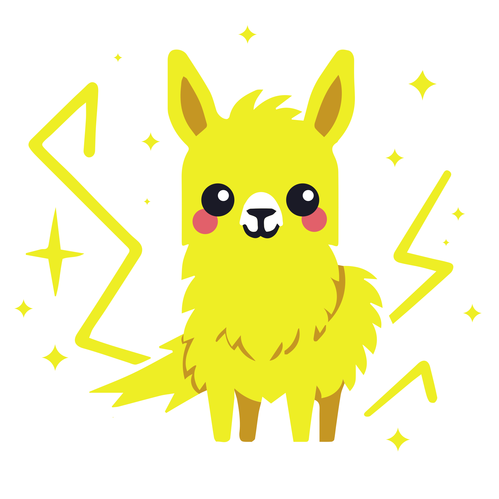
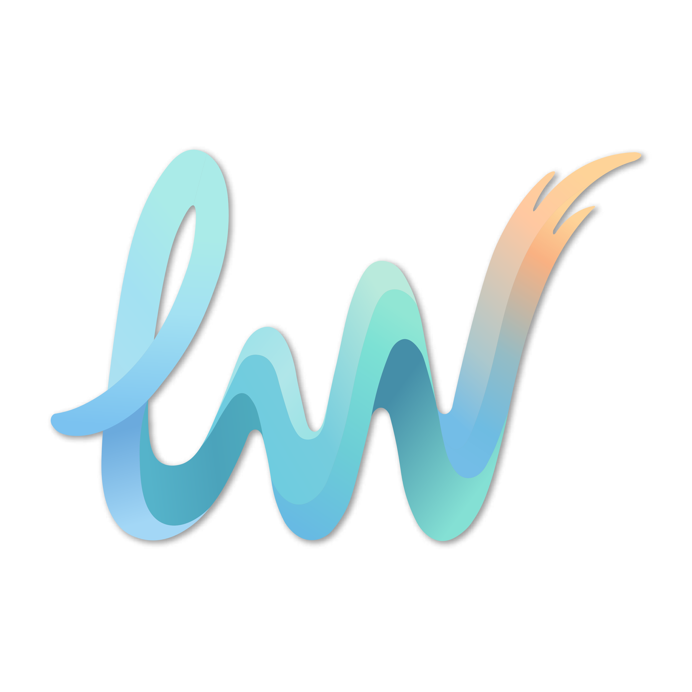

<div align="center">

<div style="margin: 20px 0;">
  
</div>

# 🚀 LightRAG: Simple and Fast Retrieval-Augmented Generation

<div align="center">
    <a href="https://trendshift.io/repositories/13043" target="_blank"></a>
</div>

<div align="center">
  <div style="width: 100%; height: 2px; margin: 20px 0; background: linear-gradient(90deg, transparent, #00d9ff, transparent);"></div>
</div>

<div align="center">
  <div style="background: linear-gradient(135deg, #667eea 0%, #764ba2 100%); border-radius: 15px; padding: 25px; text-align: center;">
    <p>
      <a href='https://github.com/HKUDS/LightRAG'></a>
      <a href='https://arxiv.org/abs/2410.05779'></a>
      <a href="https://github.com/HKUDS/LightRAG/stargazers"></a>
    </p>
    <p>
      
      <a href="https://pypi.org/project/lightrag-hku/"></a>
    </p>
    <p>
      <a href="https://discord.gg/yF2MmDJyGJ"></a>
      <a href="https://github.com/HKUDS/LightRAG/issues/285"></a>
    </p>
    <p>
      <a href="README-zh.md"></a>
      <a href="README.md"></a>
    </p>
    <p>
      <a href="https://pepy.tech/projects/lightrag-hku"></a>
    </p>
  </div>
</div>

</div>

<div align="center" style="margin: 30px 0;">
  
</div>

<div align="center" style="margin: 30px 0;">
    
</div>

---

<div align="center">
  <table>
    <tr>
      <td style="vertical-align: middle;">
        
      </td>
      <td style="vertical-align: middle; padding-left: 12px;">
        <a href="https://litewrite.ai">
          
        </a>
      </td>
    </tr>
  </table>
</div>

---

## 🎉 News
- [2026.03]🎯[New Feature]: Integrated **OpenSearch** as a unified storage backend, providing comprehensive support for all four LightRAG storage.
- [2026.03]🎯[New Feature]: Introduced a setup wizard. Support for local deployment of embedding, reranking, and storage backends via Docker.
- [2025.11]🎯[New Feature]: Integrated **RAGAS for Evaluation** and **Langfuse for Tracing**. Updated the API to return retrieved contexts alongside query results to support context precision metrics.
- [2025.10]🎯[Scalability Enhancement]: Eliminated processing bottlenecks to support **Large-Scale Datasets Efficiently**.
- [2025.09]🎯[New Feature] Enhances knowledge graph extraction accuracy for **Open-Sourced LLMs** such as Qwen3-30B-A3B.
- [2025.08]🎯[New Feature] **Reranker** is now supported, significantly boosting performance for mixed queries (set as default query mode).
- [2025.08]🎯[New Feature] Added **Document Deletion** with automatic KG regeneration to ensure optimal query performance.
- [2025.06]🎯[New Release] Our team has released [RAG-Anything](https://github.com/HKUDS/RAG-Anything) — an **All-in-One Multimodal RAG** system for seamless processing of text, images, tables, and equations.
- [2025.06]🎯[New Feature] LightRAG now supports comprehensive multimodal data handling through [RAG-Anything](https://github.com/HKUDS/RAG-Anything) integration, enabling seamless document parsing and RAG capabilities across diverse formats including PDFs, images, Office documents, tables, and formulas. Please refer to the new [multimodal section](https://github.com/HKUDS/LightRAG/?tab=readme-ov-file#multimodal-document-processing-rag-anything-integration) for details.
- [2025.03]🎯[New Feature] LightRAG now supports citation functionality, enabling proper source attribution and enhanced document traceability.
- [2025.02]🎯[New Feature] You can now use MongoDB as an all-in-one storage solution for unified data management.
- [2025.02]🎯[New Release] Our team has released [VideoRAG](https://github.com/HKUDS/VideoRAG)-a RAG system for understanding extremely long-context videos
- [2025.01]🎯[New Release] Our team has released [MiniRAG](https://github.com/HKUDS/MiniRAG) making RAG simpler with small models.
- [2025.01]🎯You can now use PostgreSQL as an all-in-one storage solution for data management.
- [2024.11]🎯[New Resource] A comprehensive guide to LightRAG is now available on [LearnOpenCV](https://learnopencv.com/lightrag). — explore in-depth tutorials and best practices. Many thanks to the blog author for this excellent contribution!
- [2024.11]🎯[New Feature] Introducing the LightRAG WebUI — an interface that allows you to insert, query, and visualize LightRAG knowledge through an intuitive web-based dashboard.
- [2024.11]🎯[New Feature] You can now [use Neo4J for Storage](https://github.com/HKUDS/LightRAG?tab=readme-ov-file#using-neo4j-for-storage)-enabling graph database support.
- [2024.10]🎯[New Feature] We've added a link to a [LightRAG Introduction Video](https://youtu.be/oageL-1I0GE). — a walkthrough of LightRAG's capabilities. Thanks to the author for this excellent contribution!
- [2024.10]🎯[New Channel] We have created a [Discord channel](https://discord.gg/yF2MmDJyGJ)!💬 Welcome to join our community for sharing, discussions, and collaboration! 🎉🎉

<details>
  <summary style="font-size: 1.4em; font-weight: bold; cursor: pointer; display: list-item;">
    Algorithm Flowchart
  </summary>


*Figure 1: LightRAG Indexing Flowchart - Img Caption : [Source](https://learnopencv.com/lightrag/)*

*Figure 2: LightRAG Retrieval and Querying Flowchart - Img Caption : [Source](https://learnopencv.com/lightrag/)*

</details>

## Installation

**💡 Using uv for Package Management**: This project uses [uv](https://docs.astral.sh/uv/) for fast and reliable Python package management. Install uv first: `curl -LsSf https://astral.sh/uv/install.sh | sh` (Unix/macOS) or `powershell -c "irm https://astral.sh/uv/install.ps1 | iex"` (Windows)

> **Note**: You can also use pip if you prefer, but uv is recommended for better performance and more reliable dependency management.
>
> **📦 Offline Deployment**: For offline or air-gapped environments, see the [Offline Deployment Guide](./docs/OfflineDeployment.md) for instructions on pre-installing all dependencies and cache files.

### Install LightRAG Server

The LightRAG Server is designed to provide Web UI and API support. The Web UI facilitates document indexing, knowledge graph exploration, and a simple RAG query interface. LightRAG Server also provide an Ollama compatible interfaces, aiming to emulate LightRAG as an Ollama chat model. This allows AI chat bot, such as Open WebUI, to access LightRAG easily.

* Install from PyPI

```bash
### Install LightRAG Server as tool using uv (recommended)
uv tool install "lightrag-hku[api]"

### Or using pip
# python -m venv .venv
# source .venv/bin/activate  # Windows: .venv\Scripts\activate
# pip install "lightrag-hku[api]"

### Build front-end artifacts
cd lightrag_webui
bun install --frozen-lockfile
bun run build
cd ..

# Setup env file
# Obtain the env.example file by downloading it from the GitHub repository root
# or by copying it from a local source checkout.
cp env.example .env  # Update the .env with your LLM and embedding configurations
# Launch the server
lightrag-server
```

* Installation from Source

```bash
git clone https://github.com/HKUDS/LightRAG.git
cd LightRAG

# Bootstrap the development environment (recommended)
make dev
source .venv/bin/activate  # Activate the virtual environment (Linux/macOS)
# Or on Windows: .venv\Scripts\activate

# make dev installs the test toolchain plus the full offline stack
# (API, storage backends, and provider integrations), then builds the frontend.
# Run make env-base or copy env.example to .env before starting the server.

# Equivalent manual steps with uv
# Note: uv sync automatically creates a virtual environment in .venv/
uv sync --extra test --extra offline
source .venv/bin/activate  # Activate the virtual environment (Linux/macOS)
# Or on Windows: .venv\Scripts\activate

### Or using pip with virtual environment
# python -m venv .venv
# source .venv/bin/activate  # Windows: .venv\Scripts\activate
# pip install -e ".[test,offline]"

# Build front-end artifacts
cd lightrag_webui
bun install --frozen-lockfile
bun run build
cd ..

# setup env file
make env-base  # Or: cp env.example .env and update it manually
# Launch API-WebUI server
lightrag-server
```

* Launching the LightRAG Server with Docker Compose

```bash
git clone https://github.com/HKUDS/LightRAG.git
cd LightRAG
cp env.example .env  # Update the .env with your LLM and embedding configurations
# modify LLM and Embedding settings in .env
docker compose up
```

> Historical versions of LightRAG docker images can be found here: [LightRAG Docker Images]( https://github.com/HKUDS/LightRAG/pkgs/container/lightrag)
>
> Official GHCR images published by GitHub Actions are signed with Sigstore Cosign using GitHub OIDC. See [docs/DockerDeployment.md](./docs/DockerDeployment.md#verify-official-ghcr-images-with-cosign) for verification commands.

### Create .env File With Setup Tool

Instead of editing `env.example` by hand, use the interactive setup wizard to generate a configured `.env` and, when needed, `docker-compose.final.yml`:

```bash
make env-base           # Required first step: LLM, embedding, reranker
make env-storage        # Optional: storage backends and database services
make env-server         # Optional: server port, auth, and SSL
make env-base-rewrite   # Optional: force-regenerate wizard-managed compose services
make env-storage-rewrite # Optional: force-regenerate wizard-managed compose services
make env-security-check # Optional: audit the current .env for security risks
```

For full description of every target see [docs/InteractiveSetup.md](./docs/InteractiveSetup.md).
The setup wizards update configuration only; run `make env-security-check` separately to audit the
current `.env` for security risks before deployment.
By default, rerunning the setup preserves unchanged wizard-managed compose service blocks; use a
`*-rewrite` target only when you need to rebuild those managed blocks from the bundled templates.

### Install  LightRAG Core

* Install from source (Recommended)

```bash
cd LightRAG
# Note: uv sync automatically creates a virtual environment in .venv/
uv sync
source .venv/bin/activate  # Activate the virtual environment (Linux/macOS)
# Or on Windows: .venv\Scripts\activate

# Or: pip install -e .
```

* Install from PyPI

```bash
uv pip install lightrag-hku
# Or: pip install lightrag-hku
```

## Quick Start

### LLM and Technology Stack Requirements for LightRAG

LightRAG's demands on the capabilities of Large Language Models (LLMs) are significantly higher than those of traditional RAG, as it requires the LLM to perform entity-relationship extraction tasks from documents. Configuring appropriate Embedding and Reranker models is also crucial for improving query performance.

- **LLM Selection**:
  - It is recommended to use an LLM with at least 32 billion parameters.
  - The context length should be at least 32KB, with 64KB being recommended.
  - It is not recommended to choose reasoning models during the document indexing stage.
  - During the query stage, it is recommended to choose models with stronger capabilities than those used in the indexing stage to achieve better query results.
- **Embedding Model**:
  - A high-performance Embedding model is essential for RAG.
  - We recommend using mainstream multilingual Embedding models, such as: `BAAI/bge-m3` and `text-embedding-3-large`.
  - **Important Note**: The Embedding model must be determined before document indexing, and the same model must be used during the document query phase. For certain storage solutions (e.g., PostgreSQL), the vector dimension must be defined upon initial table creation. Therefore, when changing embedding models, it is necessary to delete the existing vector-related tables and allow LightRAG to recreate them with the new dimensions.
- **Reranker Model Configuration**:
  - Configuring a Reranker model can significantly enhance LightRAG's retrieval performance.
  - When a Reranker model is enabled, it is recommended to set the "mix mode" as the default query mode.
  - We recommend using mainstream Reranker models, such as: `BAAI/bge-reranker-v2-m3` or models provided by services like Jina.

### Quick Start for LightRAG Server

The LightRAG Server is designed to provide Web UI and API support. The LightRAG Server offers a comprehensive knowledge graph visualization feature. It supports various gravity layouts, node queries, subgraph filtering, and more. For more information about LightRAG Server, please refer to [LightRAG Server](./docs/LightRAG-API-Server.md).


### Quick Start for LightRAG core

To get started with LightRAG core, refer to the sample codes available in the `examples` folder. Additionally, a [video demo](https://www.youtube.com/watch?v=g21royNJ4fw) demonstration is provided to guide you through the local setup process. If you already possess an OpenAI API key, you can run the demo right away:

```bash
### you should run the demo code with project folder
cd LightRAG
### provide your API-KEY for OpenAI
export OPENAI_API_KEY="sk-...your_opeai_key..."
### download the demo document of "A Christmas Carol" by Charles Dickens
curl https://raw.githubusercontent.com/gusye1234/nano-graphrag/main/tests/mock_data.txt > ./book.txt
### run the demo code
python examples/lightrag_openai_demo.py
```

For a streaming response implementation example, please see `examples/lightrag_openai_compatible_demo.py`. Prior to execution, ensure you modify the sample code's LLM and embedding configurations accordingly.

**Note 1**: When running the demo program, please be aware that different test scripts may use different embedding models. If you switch to a different embedding model, you must clear the data directory (`./dickens`); otherwise, the program may encounter errors. If you wish to retain the LLM cache, you can preserve the `kv_store_llm_response_cache.json` file while clearing the data directory.

**Note 2**: Only `lightrag_openai_demo.py` and `lightrag_openai_compatible_demo.py` are officially supported sample codes. Other sample files are community contributions that haven't undergone full testing and optimization.

## Programming with LightRAG Core

For the complete Core API reference — including init parameters, `QueryParam`, LLM/embedding provider examples (OpenAI, Ollama, Azure, Gemini, HuggingFace, LlamaIndex), reranker injection, insert operations, entity/relation management, and delete/merge — see **[docs/ProgramingWithCore.md](./docs/ProgramingWithCore.md)**.

> ⚠️ **If you would like to integrate LightRAG into your project, we recommend utilizing the REST API provided by the LightRAG Server**. LightRAG Core is typically intended for embedded applications or for researchers who wish to conduct studies and evaluations.

### Advanced Features

LightRAG provides additional capabilities including token usage tracking, knowledge graph data export, LLM cache management, Langfuse observability integration, and RAGAS-based evaluation. See **[docs/AdvancedFeatures.md](./docs/AdvancedFeatures.md)**.

### Multimodal Document Processing (RAG-Anything Integration)

LightRAG integrates with [RAG-Anything](https://github.com/HKUDS/RAG-Anything) for end-to-end multimodal RAG across PDFs, Office documents, images, tables, and formulas. For setup and usage examples, see **[docs/AdvancedFeatures.md](./docs/AdvancedFeatures.md)**.

> LightRAG Server will soon integrate RAG-Anything’s multimodal processing capabilities into its file processing pipeline. Stay tuned.

## Replicating Findings in the Papper

LightRAG consistently outperforms NaiveRAG, RQ-RAG, HyDE, and GraphRAG across agriculture, computer science, legal, and mixed domains. For the full evaluation methodology, prompts, and reproduce steps, see **[docs/Reproduce.md](./docs/Reproduce.md)**.

**Overall Performance Table**

||**Agriculture**||**CS**||**Legal**||**Mix**||
|----------------------|---------------|------------|------|------------|---------|------------|-------|------------|
||NaiveRAG|**LightRAG**|NaiveRAG|**LightRAG**|NaiveRAG|**LightRAG**|NaiveRAG|**LightRAG**|
|**Comprehensiveness**|32.4%|**67.6%**|38.4%|**61.6%**|16.4%|**83.6%**|38.8%|**61.2%**|
|**Diversity**|23.6%|**76.4%**|38.0%|**62.0%**|13.6%|**86.4%**|32.4%|**67.6%**|
|**Empowerment**|32.4%|**67.6%**|38.8%|**61.2%**|16.4%|**83.6%**|42.8%|**57.2%**|
|**Overall**|32.4%|**67.6%**|38.8%|**61.2%**|15.2%|**84.8%**|40.0%|**60.0%**|
||RQ-RAG|**LightRAG**|RQ-RAG|**LightRAG**|RQ-RAG|**LightRAG**|RQ-RAG|**LightRAG**|
|**Comprehensiveness**|31.6%|**68.4%**|38.8%|**61.2%**|15.2%|**84.8%**|39.2%|**60.8%**|
|**Diversity**|29.2%|**70.8%**|39.2%|**60.8%**|11.6%|**88.4%**|30.8%|**69.2%**|
|**Empowerment**|31.6%|**68.4%**|36.4%|**63.6%**|15.2%|**84.8%**|42.4%|**57.6%**|
|**Overall**|32.4%|**67.6%**|38.0%|**62.0%**|14.4%|**85.6%**|40.0%|**60.0%**|
||HyDE|**LightRAG**|HyDE|**LightRAG**|HyDE|**LightRAG**|HyDE|**LightRAG**|
|**Comprehensiveness**|26.0%|**74.0%**|41.6%|**58.4%**|26.8%|**73.2%**|40.4%|**59.6%**|
|**Diversity**|24.0%|**76.0%**|38.8%|**61.2%**|20.0%|**80.0%**|32.4%|**67.6%**|
|**Empowerment**|25.2%|**74.8%**|40.8%|**59.2%**|26.0%|**74.0%**|46.0%|**54.0%**|
|**Overall**|24.8%|**75.2%**|41.6%|**58.4%**|26.4%|**73.6%**|42.4%|**57.6%**|
||GraphRAG|**LightRAG**|GraphRAG|**LightRAG**|GraphRAG|**LightRAG**|GraphRAG|**LightRAG**|
|**Comprehensiveness**|45.6%|**54.4%**|48.4%|**51.6%**|48.4%|**51.6%**|**50.4%**|49.6%|
|**Diversity**|22.8%|**77.2%**|40.8%|**59.2%**|26.4%|**73.6%**|36.0%|**64.0%**|
|**Empowerment**|41.2%|**58.8%**|45.2%|**54.8%**|43.6%|**56.4%**|**50.8%**|49.2%|
|**Overall**|45.2%|**54.8%**|48.0%|**52.0%**|47.2%|**52.8%**|**50.4%**|49.6%|


## 🔗 Related Projects

*Ecosystem & Extensions*

<div align="center">
  <table>
    <tr>
      <td align="center">
        <a href="https://github.com/HKUDS/RAG-Anything">
          <div style="width: 100px; height: 100px; background: linear-gradient(135deg, rgba(0, 217, 255, 0.1) 0%, rgba(0, 217, 255, 0.05) 100%); border-radius: 15px; border: 1px solid rgba(0, 217, 255, 0.2); display: flex; align-items: center; justify-content: center; margin-bottom: 10px;">
            <span style="font-size: 32px;">📸</span>
          </div>
          <b>RAG-Anything</b><br>
          <sub>Multimodal RAG</sub>
        </a>
      </td>
      <td align="center">
        <a href="https://github.com/HKUDS/VideoRAG">
          <div style="width: 100px; height: 100px; background: linear-gradient(135deg, rgba(0, 217, 255, 0.1) 0%, rgba(0, 217, 255, 0.05) 100%); border-radius: 15px; border: 1px solid rgba(0, 217, 255, 0.2); display: flex; align-items: center; justify-content: center; margin-bottom: 10px;">
            <span style="font-size: 32px;">🎥</span>
          </div>
          <b>VideoRAG</b><br>
          <sub>Extreme Long-Context Video RAG</sub>
        </a>
      </td>
      <td align="center">
        <a href="https://github.com/HKUDS/MiniRAG">
          <div style="width: 100px; height: 100px; background: linear-gradient(135deg, rgba(0, 217, 255, 0.1) 0%, rgba(0, 217, 255, 0.05) 100%); border-radius: 15px; border: 1px solid rgba(0, 217, 255, 0.2); display: flex; align-items: center; justify-content: center; margin-bottom: 10px;">
            <span style="font-size: 32px;">✨</span>
          </div>
          <b>MiniRAG</b><br>
          <sub>Extremely Simple RAG</sub>
        </a>
      </td>
    </tr>
  </table>
</div>

---

## ⭐ Star History

[](https://star-history.com/#HKUDS/LightRAG&Date)

## 🤝 Contribution

<div align="center">
  We welcome contributions of all kinds — bug fixes, new features, documentation improvements, and more.<br>
  Please read our <a href=".github/CONTRIBUTING.md"><strong>Contributing Guide</strong></a> before submitting a pull request.
</div>

<br>

<div align="center">
  We thank all our contributors for their valuable contributions.
</div>

<div align="center">
  <a href="https://github.com/HKUDS/LightRAG/graphs/contributors">
    
  </a>
</div>


## 📖 Citation

```python
@article{guo2024lightrag,
title={LightRAG: Simple and Fast Retrieval-Augmented Generation},
author={Zirui Guo and Lianghao Xia and Yanhua Yu and Tu Ao and Chao Huang},
year={2024},
eprint={2410.05779},
archivePrefix={arXiv},
primaryClass={cs.IR}
}
```

---

<div align="center" style="background: linear-gradient(135deg, #667eea 0%, #764ba2 100%); border-radius: 15px; padding: 30px; margin: 30px 0;">
  <div>
    
  </div>
  <div style="margin-top: 20px;">
    <a href="https://github.com/HKUDS/LightRAG" style="text-decoration: none;">
      
    </a>
    <a href="https://github.com/HKUDS/LightRAG/issues" style="text-decoration: none;">
      
    </a>
    <a href="https://github.com/HKUDS/LightRAG/discussions" style="text-decoration: none;">
      
    </a>
  </div>
</div>

<div align="center">
  <div style="width: 100%; max-width: 600px; margin: 20px auto; padding: 20px; background: linear-gradient(135deg, rgba(0, 217, 255, 0.1) 0%, rgba(0, 217, 255, 0.05) 100%); border-radius: 15px; border: 1px solid rgba(0, 217, 255, 0.2);">
    <div style="display: flex; justify-content: center; align-items: center; gap: 15px;">
      <span style="font-size: 24px;">⭐</span>
      <span style="color: #00d9ff; font-size: 18px;">Thank you for visiting LightRAG!</span>
      <span style="font-size: 24px;">⭐</span>
    </div>
  </div>
</div>


LightRAG
├─ .clinerules
│  └─ 01-basic.md
├─ .dockerignore
├─ .kilo
│  ├─ agent-manager.json
│  └─ worktrees
│     ├─ .metadata_never_index
│     └─ granite-egg
│        ├─ .clinerules
│        │  └─ 01-basic.md
│        ├─ .dockerignore
│        ├─ .pre-commit-config.yaml
│        ├─ AGENTS.md
│        ├─ Dockerfile
│        ├─ Dockerfile.lite
│        ├─ LICENSE
│        ├─ MANIFEST.in
│        ├─ Makefile
│        ├─ README-zh.md
│        ├─ README.assets
│        │  ├─ b2aaf634151b4706892693ffb43d9093.png
│        │  └─ iShot_2025-03-23_12.40.08.png
│        ├─ README.md
│        ├─ SECURITY.md
│        ├─ assets
│        │  ├─ LiteWrite.png
│        │  └─ logo.png
│        ├─ docker-build-push.sh
│        ├─ docker-compose-full.yml
│        ├─ docker-compose.yml
│        ├─ docs
│        │  ├─ AdvancedFeatures.md
│        │  ├─ Algorithm.md
│        │  ├─ AsymmetricEmbedding.md
│        │  ├─ DockerDeployment.md
│        │  ├─ FrontendBuildGuide.md
│        │  ├─ InteractiveSetup.md
│        │  ├─ LightRAG-API-Server-zh.md
│        │  ├─ LightRAG-API-Server.assets
│        │  │  ├─ image-20250323122538997.png
│        │  │  ├─ image-20250323122754387.png
│        │  │  ├─ image-20250323123011220.png
│        │  │  └─ image-20250323194750379.png
│        │  ├─ LightRAG-API-Server.md
│        │  ├─ LightRAG_concurrent_explain.md
│        │  ├─ MilvusConfigurationGuide.md
│        │  ├─ OfflineDeployment.md
│        │  ├─ ProgramingWithCore.md
│        │  ├─ Reproduce.md
│        │  └─ UV_LOCK_GUIDE.md
│        ├─ env.docker-compose-full
│        ├─ env.example
│        ├─ examples
│        │  ├─ generate_query.py
│        │  ├─ graph_visual_with_html.py
│        │  ├─ graph_visual_with_neo4j.py
│        │  ├─ graph_visual_with_opensearch.py
│        │  ├─ insert_custom_kg.py
│        │  ├─ lightrag_ag2_multiagent_demo.py
│        │  ├─ lightrag_azure_openai_demo.py
│        │  ├─ lightrag_gemini_demo.py
│        │  ├─ lightrag_gemini_postgres_demo.py
│        │  ├─ lightrag_gemini_workspace_demo.py
│        │  ├─ lightrag_ollama_demo.py
│        │  ├─ lightrag_openai_compatible_demo.py
│        │  ├─ lightrag_openai_demo.py
│        │  ├─ lightrag_openai_mongodb_graph_demo.py
│        │  ├─ lightrag_openai_opensearch_graph_demo.py
│        │  ├─ lightrag_vllm_demo.py
│        │  ├─ milvus_kwargs_configuration_demo.py
│        │  ├─ modalprocessors_example.py
│        │  ├─ opensearch_storage_demo.py
│        │  ├─ raganything_example.py
│        │  ├─ rerank_example.py
│        │  └─ unofficial-sample
│        │     ├─ copy_llm_cache_to_another_storage.py
│        │     ├─ lightrag_bedrock_demo.py
│        │     ├─ lightrag_cloudflare_demo.py
│        │     ├─ lightrag_embedding_prefixes.py
│        │     ├─ lightrag_hf_demo.py
│        │     ├─ lightrag_llamaindex_direct_demo.py
│        │     ├─ lightrag_llamaindex_litellm_demo.py
│        │     ├─ lightrag_llamaindex_litellm_opik_demo.py
│        │     ├─ lightrag_lmdeploy_demo.py
│        │     ├─ lightrag_nvidia_demo.py
│        │     └─ lightrag_openai_neo4j_milvus_redis_demo.py
│        ├─ k8s-deploy
│        │  ├─ README-zh.md
│        │  ├─ README.md
│        │  ├─ databases
│        │  │  ├─ 00-config.sh
│        │  │  ├─ 01-prepare.sh
│        │  │  ├─ 02-install-database.sh
│        │  │  ├─ 03-uninstall-database.sh
│        │  │  ├─ 04-cleanup.sh
│        │  │  ├─ README.md
│        │  │  ├─ elasticsearch
│        │  │  │  └─ values.yaml
│        │  │  ├─ install-kubeblocks.sh
│        │  │  ├─ mongodb
│        │  │  │  └─ values.yaml
│        │  │  ├─ neo4j
│        │  │  │  └─ values.yaml
│        │  │  ├─ postgresql
│        │  │  │  └─ values.yaml
│        │  │  ├─ qdrant
│        │  │  │  └─ values.yaml
│        │  │  ├─ redis
│        │  │  │  └─ values.yaml
│        │  │  ├─ scripts
│        │  │  │  └─ common.sh
│        │  │  └─ uninstall-kubeblocks.sh
│        │  ├─ install_lightrag.sh
│        │  ├─ install_lightrag_dev.sh
│        │  ├─ lightrag
│        │  │  ├─ .helmignore
│        │  │  ├─ Chart.yaml
│        │  │  ├─ templates
│        │  │  │  ├─ NOTES.txt
│        │  │  │  ├─ _helpers.tpl
│        │  │  │  ├─ deployment.yaml
│        │  │  │  ├─ pvc.yaml
│        │  │  │  ├─ secret.yaml
│        │  │  │  └─ service.yaml
│        │  │  └─ values.yaml
│        │  ├─ uninstall_lightrag.sh
│        │  └─ uninstall_lightrag_dev.sh
│        ├─ lightrag
│        │  ├─ __init__.py
│        │  ├─ _version.py
│        │  ├─ api
│        │  │  ├─ __init__.py
│        │  │  ├─ auth.py
│        │  │  ├─ config.py
│        │  │  ├─ gunicorn_config.py
│        │  │  ├─ lightrag_server.py
│        │  │  ├─ passwords.py
│        │  │  ├─ routers
│        │  │  │  ├─ __init__.py
│        │  │  │  ├─ document_routes.py
│        │  │  │  ├─ graph_routes.py
│        │  │  │  ├─ ollama_api.py
│        │  │  │  └─ query_routes.py
│        │  │  ├─ run_with_gunicorn.py
│        │  │  ├─ runtime_validation.py
│        │  │  ├─ static
│        │  │  │  └─ swagger-ui
│        │  │  │     ├─ favicon-32x32.png
│        │  │  │     ├─ swagger-ui-bundle.js
│        │  │  │     └─ swagger-ui.css
│        │  │  └─ utils_api.py
│        │  ├─ base.py
│        │  ├─ constants.py
│        │  ├─ evaluation
│        │  │  ├─ README_EVALUASTION_RAGAS.md
│        │  │  ├─ __init__.py
│        │  │  ├─ eval_rag_quality.py
│        │  │  ├─ sample_dataset.json
│        │  │  └─ sample_documents
│        │  │     ├─ 01_lightrag_overview.md
│        │  │     ├─ 02_rag_architecture.md
│        │  │     ├─ 03_lightrag_improvements.md
│        │  │     ├─ 04_supported_databases.md
│        │  │     ├─ 05_evaluation_and_deployment.md
│        │  │     └─ README.md
│        │  ├─ exceptions.py
│        │  ├─ kg
│        │  │  ├─ __init__.py
│        │  │  ├─ deprecated
│        │  │  │  └─ chroma_impl.py
│        │  │  ├─ faiss_impl.py
│        │  │  ├─ json_doc_status_impl.py
│        │  │  ├─ json_kv_impl.py
│        │  │  ├─ memgraph_impl.py
│        │  │  ├─ milvus_impl.py
│        │  │  ├─ mongo_impl.py
│        │  │  ├─ nano_vector_db_impl.py
│        │  │  ├─ neo4j_impl.py
│        │  │  ├─ networkx_impl.py
│        │  │  ├─ opensearch_impl.py
│        │  │  ├─ postgres_impl.py
│        │  │  ├─ qdrant_impl.py
│        │  │  ├─ redis_impl.py
│        │  │  └─ shared_storage.py
│        │  ├─ lightrag.py
│        │  ├─ llm
│        │  │  ├─ __init__.py
│        │  │  ├─ anthropic.py
│        │  │  ├─ azure_openai.py
│        │  │  ├─ bedrock.py
│        │  │  ├─ binding_options.py
│        │  │  ├─ deprecated
│        │  │  │  └─ siliconcloud.py
│        │  │  ├─ gemini.py
│        │  │  ├─ hf.py
│        │  │  ├─ jina.py
│        │  │  ├─ llama_index_impl.py
│        │  │  ├─ lmdeploy.py
│        │  │  ├─ lollms.py
│        │  │  ├─ nvidia_openai.py
│        │  │  ├─ ollama.py
│        │  │  ├─ openai.py
│        │  │  ├─ voyageai.py
│        │  │  └─ zhipu.py
│        │  ├─ namespace.py
│        │  ├─ operate.py
│        │  ├─ prompt.py
│        │  ├─ rerank.py
│        │  ├─ tools
│        │  │  ├─ README_CLEAN_LLM_QUERY_CACHE.md
│        │  │  ├─ README_MIGRATE_LLM_CACHE.md
│        │  │  ├─ __init__.py
│        │  │  ├─ check_initialization.py
│        │  │  ├─ clean_llm_query_cache.py
│        │  │  ├─ download_cache.py
│        │  │  ├─ hash_password.py
│        │  │  ├─ lightrag_visualizer
│        │  │  │  ├─ README-zh.md
│        │  │  │  ├─ README.md
│        │  │  │  ├─ __init__.py
│        │  │  │  ├─ assets
│        │  │  │  │  ├─ Geist-Regular.ttf
│        │  │  │  │  ├─ LICENSE - Geist.txt
│        │  │  │  │  ├─ LICENSE - SmileySans.txt
│        │  │  │  │  ├─ SmileySans-Oblique.ttf
│        │  │  │  │  └─ place_font_here
│        │  │  │  ├─ graph_visualizer.py
│        │  │  │  └─ requirements.txt
│        │  │  ├─ migrate_llm_cache.py
│        │  │  └─ prepare_qdrant_legacy_data.py
│        │  ├─ types.py
│        │  ├─ utils.py
│        │  └─ utils_graph.py
│        ├─ lightrag.service.example
│        ├─ lightrag_webui
│        │  ├─ .prettierrc.json
│        │  ├─ README.md
│        │  ├─ bun.lock
│        │  ├─ components.json
│        │  ├─ env.development.smaple
│        │  ├─ env.local.sample
│        │  ├─ eslint.config.js
│        │  ├─ index.html
│        │  ├─ package.json
│        │  ├─ public
│        │  │  ├─ favicon.png
│        │  │  └─ logo.svg
│        │  ├─ src
│        │  │  ├─ App.tsx
│        │  │  ├─ AppRouter.tsx
│        │  │  ├─ api
│        │  │  │  ├─ lightrag.test.ts
│        │  │  │  └─ lightrag.ts
│        │  │  ├─ components
│        │  │  │  ├─ ApiKeyAlert.tsx
│        │  │  │  ├─ AppSettings.tsx
│        │  │  │  ├─ LanguageToggle.tsx
│        │  │  │  ├─ Root.tsx
│        │  │  │  ├─ ThemeProvider.tsx
│        │  │  │  ├─ ThemeToggle.tsx
│        │  │  │  ├─ documents
│        │  │  │  │  ├─ ClearDocumentsDialog.tsx
│        │  │  │  │  ├─ DeleteDocumentsDialog.tsx
│        │  │  │  │  ├─ PipelineStatusDialog.tsx
│        │  │  │  │  └─ UploadDocumentsDialog.tsx
│        │  │  │  ├─ graph
│        │  │  │  │  ├─ EditablePropertyRow.tsx
│        │  │  │  │  ├─ FocusOnNode.tsx
│        │  │  │  │  ├─ FullScreenControl.tsx
│        │  │  │  │  ├─ GraphControl.tsx
│        │  │  │  │  ├─ GraphLabels.tsx
│        │  │  │  │  ├─ GraphSearch.tsx
│        │  │  │  │  ├─ LayoutsControl.tsx
│        │  │  │  │  ├─ Legend.tsx
│        │  │  │  │  ├─ LegendButton.tsx
│        │  │  │  │  ├─ MergeDialog.tsx
│        │  │  │  │  ├─ PropertiesView.tsx
│        │  │  │  │  ├─ PropertyEditDialog.tsx
│        │  │  │  │  ├─ PropertyRowComponents.tsx
│        │  │  │  │  ├─ Settings.tsx
│        │  │  │  │  ├─ SettingsDisplay.tsx
│        │  │  │  │  └─ ZoomControl.tsx
│        │  │  │  ├─ icons
│        │  │  │  │  └─ GithubIcon.tsx
│        │  │  │  ├─ retrieval
│        │  │  │  │  ├─ ChatMessage.tsx
│        │  │  │  │  └─ QuerySettings.tsx
│        │  │  │  ├─ status
│        │  │  │  │  ├─ StatusCard.tsx
│        │  │  │  │  ├─ StatusDialog.tsx
│        │  │  │  │  └─ StatusIndicator.tsx
│        │  │  │  └─ ui
│        │  │  │     ├─ Alert.tsx
│        │  │  │     ├─ AlertDialog.tsx
│        │  │  │     ├─ AsyncSearch.tsx
│        │  │  │     ├─ AsyncSelect.tsx
│        │  │  │     ├─ Badge.tsx
│        │  │  │     ├─ Button.tsx
│        │  │  │     ├─ Card.tsx
│        │  │  │     ├─ Checkbox.tsx
│        │  │  │     ├─ Command.tsx
│        │  │  │     ├─ DataTable.tsx
│        │  │  │     ├─ Dialog.tsx
│        │  │  │     ├─ EmptyCard.tsx
│        │  │  │     ├─ FileUploader.tsx
│        │  │  │     ├─ Input.tsx
│        │  │  │     ├─ NumberInput.tsx
│        │  │  │     ├─ PaginationControls.tsx
│        │  │  │     ├─ Popover.tsx
│        │  │  │     ├─ Progress.tsx
│        │  │  │     ├─ ScrollArea.tsx
│        │  │  │     ├─ Select.tsx
│        │  │  │     ├─ Separator.tsx
│        │  │  │     ├─ TabContent.tsx
│        │  │  │     ├─ Table.tsx
│        │  │  │     ├─ Tabs.tsx
│        │  │  │     ├─ Text.tsx
│        │  │  │     ├─ Textarea.tsx
│        │  │  │     ├─ Tooltip.tsx
│        │  │  │     └─ UserPromptInputWithHistory.tsx
│        │  │  ├─ contexts
│        │  │  │  ├─ TabVisibilityProvider.tsx
│        │  │  │  ├─ context.ts
│        │  │  │  ├─ types.ts
│        │  │  │  └─ useTabVisibility.ts
│        │  │  ├─ features
│        │  │  │  ├─ ApiSite.tsx
│        │  │  │  ├─ DocumentManager.tsx
│        │  │  │  ├─ GraphViewer.tsx
│        │  │  │  ├─ LoginPage.tsx
│        │  │  │  ├─ RetrievalTesting.tsx
│        │  │  │  └─ SiteHeader.tsx
│        │  │  ├─ hooks
│        │  │  │  ├─ useDebounce.tsx
│        │  │  │  ├─ useLightragGraph.tsx
│        │  │  │  ├─ useRandomGraph.tsx
│        │  │  │  └─ useTheme.tsx
│        │  │  ├─ i18n.ts
│        │  │  ├─ index.css
│        │  │  ├─ lib
│        │  │  │  ├─ constants.ts
│        │  │  │  ├─ extensions.ts
│        │  │  │  ├─ pathPrefix.test.ts
│        │  │  │  ├─ pathPrefix.ts
│        │  │  │  └─ utils.ts
│        │  │  ├─ locales
│        │  │  │  ├─ ar.json
│        │  │  │  ├─ de.json
│        │  │  │  ├─ en.json
│        │  │  │  ├─ fr.json
│        │  │  │  ├─ ja.json
│        │  │  │  ├─ ko.json
│        │  │  │  ├─ ru.json
│        │  │  │  ├─ uk.json
│        │  │  │  ├─ vi.json
│        │  │  │  ├─ zh.json
│        │  │  │  └─ zh_TW.json
│        │  │  ├─ main.tsx
│        │  │  ├─ services
│        │  │  │  └─ navigation.ts
│        │  │  ├─ stores
│        │  │  │  ├─ graph.ts
│        │  │  │  ├─ settings.ts
│        │  │  │  └─ state.ts
│        │  │  ├─ types
│        │  │  │  └─ katex.d.ts
│        │  │  ├─ utils
│        │  │  │  ├─ SearchHistoryManager.ts
│        │  │  │  ├─ clipboard.ts
│        │  │  │  ├─ graphColor.ts
│        │  │  │  └─ remarkFootnotes.ts
│        │  │  └─ vite-env.d.ts
│        │  ├─ tailwind.config.js
│        │  ├─ tsconfig.json
│        │  └─ vite.config.ts
│        ├─ pyproject.toml
│        ├─ reproduce
│        │  ├─ Step_0.py
│        │  ├─ Step_1.py
│        │  ├─ Step_1_openai_compatible.py
│        │  ├─ Step_2.py
│        │  ├─ Step_3.py
│        │  ├─ Step_3_openai_compatible.py
│        │  └─ batch_eval.py
│        ├─ requirements-offline-llm.txt
│        ├─ requirements-offline-storage.txt
│        ├─ requirements-offline.txt
│        ├─ scripts
│        │  ├─ release
│        │  │  └─ set_version.py
│        │  ├─ setup
│        │  │  ├─ lib
│        │  │  │  ├─ file_ops.sh
│        │  │  │  ├─ presets.sh
│        │  │  │  ├─ prompts.sh
│        │  │  │  ├─ storage_requirements.sh
│        │  │  │  └─ validation.sh
│        │  │  ├─ setup.sh
│        │  │  └─ templates
│        │  │     ├─ memgraph.yml
│        │  │     ├─ milvus-gpu.yml
│        │  │     ├─ milvus.yml
│        │  │     ├─ mongodb.yml
│        │  │     ├─ neo4j.yml
│        │  │     ├─ opensearch.yml
│        │  │     ├─ postgres.yml
│        │  │     ├─ qdrant-gpu.yml
│        │  │     ├─ qdrant.yml
│        │  │     ├─ redis.conf.template
│        │  │     ├─ redis.yml
│        │  │     ├─ vllm-embed-gpu.yml
│        │  │     ├─ vllm-embed.yml
│        │  │     ├─ vllm-rerank-gpu.yml
│        │  │     └─ vllm-rerank.yml
│        │  └─ test.sh
│        ├─ setup.py
│        ├─ tests
│        │  ├─ README_WORKSPACE_ISOLATION_TESTS.md
│        │  ├─ __init__.py
│        │  ├─ conftest.py
│        │  ├─ test_aquery_data_endpoint.py
│        │  ├─ test_asymmetric_embedding.py
│        │  ├─ test_auth.py
│        │  ├─ test_batch_embeddings.py
│        │  ├─ test_batch_graph_operations.py
│        │  ├─ test_chunking.py
│        │  ├─ test_curl_aquery_data.sh
│        │  ├─ test_degree_return_type.py
│        │  ├─ test_description_api_validation.py
│        │  ├─ test_dimension_mismatch.py
│        │  ├─ test_doc_status_chunk_preservation.py
│        │  ├─ test_document_file_path_normalization.py
│        │  ├─ test_extract_entities.py
│        │  ├─ test_faiss_meta_inconsistency.py
│        │  ├─ test_graph_storage.py
│        │  ├─ test_interactive_setup
│        │  │  ├─ __init__.py
│        │  │  ├─ _helpers.py
│        │  │  ├─ test_collect.py
│        │  │  ├─ test_env.py
│        │  │  ├─ test_generate.py
│        │  │  ├─ test_misc.py
│        │  │  └─ test_validate.py
│        │  ├─ test_lightrag_ollama_chat.py
│        │  ├─ test_llm_cache_tools_opensearch.py
│        │  ├─ test_memgraph_storage.py
│        │  ├─ test_milvus_index_config.py
│        │  ├─ test_milvus_index_creation.py
│        │  ├─ test_milvus_kwargs_bridge.py
│        │  ├─ test_mongo_storage.py
│        │  ├─ test_neo4j_fulltext_index.py
│        │  ├─ test_no_model_suffix_safety.py
│        │  ├─ test_opensearch_storage.py
│        │  ├─ test_overlap_validation.py
│        │  ├─ test_path_prefixes.py
│        │  ├─ test_postgres_age_quote_fix.py
│        │  ├─ test_postgres_client_manager.py
│        │  ├─ test_postgres_cypher_injection.py
│        │  ├─ test_postgres_halfvec.py
│        │  ├─ test_postgres_index_name.py
│        │  ├─ test_postgres_migration.py
│        │  ├─ test_postgres_performance_timing.py
│        │  ├─ test_postgres_retry_integration.py
│        │  ├─ test_postgres_upsert.py
│        │  ├─ test_postgres_upsert_edge_cypher.py
│        │  ├─ test_qdrant_migration.py
│        │  ├─ test_qdrant_upsert_batching.py
│        │  ├─ test_remove_think_tags.py
│        │  ├─ test_rerank_chunking.py
│        │  ├─ test_runtime_target_validation.py
│        │  ├─ test_token_auto_renewal.py
│        │  ├─ test_unified_lock_safety.py
│        │  ├─ test_voyageai_embed.py
│        │  ├─ test_workspace_isolation.py
│        │  ├─ test_workspace_migration_isolation.py
│        │  ├─ test_workspace_sanitization.py
│        │  ├─ test_write_json_optimization.py
│        │  └─ test_zhipu_llm.py
│        └─ uv.lock
├─ .pre-commit-config.yaml
├─ AGENTS.md
├─ Dockerfile
├─ Dockerfile.lite
├─ HƯỚNG_DẪN_CHẠY_VLLM.md
├─ LICENSE
├─ MANIFEST.in
├─ Makefile
├─ README-zh.md
├─ README.assets
│  ├─ b2aaf634151b4706892693ffb43d9093.png
│  └─ iShot_2025-03-23_12.40.08.png
├─ README.md
├─ SECURITY.md
├─ assets
│  ├─ LiteWrite.png
│  └─ logo.png
├─ docker-build-push.sh
├─ docker-compose-full.yml
├─ docker-compose.yml
├─ docs
│  ├─ AdvancedFeatures.md
│  ├─ Algorithm.md
│  ├─ AsymmetricEmbedding.md
│  ├─ DockerDeployment.md
│  ├─ FrontendBuildGuide.md
│  ├─ InteractiveSetup.md
│  ├─ LightRAG-API-Server-zh.md
│  ├─ LightRAG-API-Server.assets
│  │  ├─ image-20250323122538997.png
│  │  ├─ image-20250323122754387.png
│  │  ├─ image-20250323123011220.png
│  │  └─ image-20250323194750379.png
│  ├─ LightRAG-API-Server.md
│  ├─ LightRAG_concurrent_explain.md
│  ├─ MilvusConfigurationGuide.md
│  ├─ OfflineDeployment.md
│  ├─ ProgramingWithCore.md
│  ├─ Reproduce.md
│  └─ UV_LOCK_GUIDE.md
├─ env.docker-compose-full
├─ env.example
├─ examples
│  ├─ generate_query.py
│  ├─ graph_visual_with_html.py
│  ├─ graph_visual_with_neo4j.py
│  ├─ graph_visual_with_opensearch.py
│  ├─ insert_custom_kg.py
│  ├─ lightrag_ag2_multiagent_demo.py
│  ├─ lightrag_azure_openai_demo.py
│  ├─ lightrag_gemini_demo.py
│  ├─ lightrag_gemini_postgres_demo.py
│  ├─ lightrag_gemini_workspace_demo.py
│  ├─ lightrag_ollama_demo.py
│  ├─ lightrag_openai_compatible_demo.py
│  ├─ lightrag_openai_demo.py
│  ├─ lightrag_openai_mongodb_graph_demo.py
│  ├─ lightrag_openai_opensearch_graph_demo.py
│  ├─ lightrag_vllm_demo.py
│  ├─ milvus_kwargs_configuration_demo.py
│  ├─ modalprocessors_example.py
│  ├─ opensearch_storage_demo.py
│  ├─ raganything_example.py
│  ├─ rerank_example.py
│  └─ unofficial-sample
│     ├─ copy_llm_cache_to_another_storage.py
│     ├─ lightrag_bedrock_demo.py
│     ├─ lightrag_cloudflare_demo.py
│     ├─ lightrag_embedding_prefixes.py
│     ├─ lightrag_hf_demo.py
│     ├─ lightrag_llamaindex_direct_demo.py
│     ├─ lightrag_llamaindex_litellm_demo.py
│     ├─ lightrag_llamaindex_litellm_opik_demo.py
│     ├─ lightrag_lmdeploy_demo.py
│     ├─ lightrag_nvidia_demo.py
│     └─ lightrag_openai_neo4j_milvus_redis_demo.py
├─ k8s-deploy
│  ├─ README-zh.md
│  ├─ README.md
│  ├─ databases
│  │  ├─ 00-config.sh
│  │  ├─ 01-prepare.sh
│  │  ├─ 02-install-database.sh
│  │  ├─ 03-uninstall-database.sh
│  │  ├─ 04-cleanup.sh
│  │  ├─ README.md
│  │  ├─ elasticsearch
│  │  │  └─ values.yaml
│  │  ├─ install-kubeblocks.sh
│  │  ├─ mongodb
│  │  │  └─ values.yaml
│  │  ├─ neo4j
│  │  │  └─ values.yaml
│  │  ├─ postgresql
│  │  │  └─ values.yaml
│  │  ├─ qdrant
│  │  │  └─ values.yaml
│  │  ├─ redis
│  │  │  └─ values.yaml
│  │  ├─ scripts
│  │  │  └─ common.sh
│  │  └─ uninstall-kubeblocks.sh
│  ├─ install_lightrag.sh
│  ├─ install_lightrag_dev.sh
│  ├─ lightrag
│  │  ├─ .helmignore
│  │  ├─ Chart.yaml
│  │  ├─ templates
│  │  │  ├─ NOTES.txt
│  │  │  ├─ _helpers.tpl
│  │  │  ├─ deployment.yaml
│  │  │  ├─ pvc.yaml
│  │  │  ├─ secret.yaml
│  │  │  └─ service.yaml
│  │  └─ values.yaml
│  ├─ uninstall_lightrag.sh
│  └─ uninstall_lightrag_dev.sh
├─ lightrag
│  ├─ __init__.py
│  ├─ _version.py
│  ├─ api
│  │  ├─ __init__.py
│  │  ├─ auth.py
│  │  ├─ config.py
│  │  ├─ gunicorn_config.py
│  │  ├─ lightrag_server.py
│  │  ├─ passwords.py
│  │  ├─ routers
│  │  │  ├─ __init__.py
│  │  │  ├─ document_routes.py
│  │  │  ├─ graph_routes.py
│  │  │  ├─ ollama_api.py
│  │  │  ├─ query_routes.py
│  │  │  └─ workspace_routes.py
│  │  ├─ run_with_gunicorn.py
│  │  ├─ runtime_validation.py
│  │  ├─ static
│  │  │  └─ swagger-ui
│  │  │     ├─ favicon-32x32.png
│  │  │     ├─ swagger-ui-bundle.js
│  │  │     └─ swagger-ui.css
│  │  ├─ utils_api.py
│  │  └─ workspace_manager.py
│  ├─ base.py
│  ├─ constants.py
│  ├─ evaluation
│  │  ├─ README_EVALUASTION_RAGAS.md
│  │  ├─ __init__.py
│  │  ├─ eval_rag_quality.py
│  │  ├─ sample_dataset.json
│  │  └─ sample_documents
│  │     ├─ 01_lightrag_overview.md
│  │     ├─ 02_rag_architecture.md
│  │     ├─ 03_lightrag_improvements.md
│  │     ├─ 04_supported_databases.md
│  │     ├─ 05_evaluation_and_deployment.md
│  │     └─ README.md
│  ├─ exceptions.py
│  ├─ kg
│  │  ├─ __init__.py
│  │  ├─ deprecated
│  │  │  └─ chroma_impl.py
│  │  ├─ faiss_impl.py
│  │  ├─ json_doc_status_impl.py
│  │  ├─ json_kv_impl.py
│  │  ├─ memgraph_impl.py
│  │  ├─ milvus_impl.py
│  │  ├─ mongo_impl.py
│  │  ├─ nano_vector_db_impl.py
│  │  ├─ neo4j_impl.py
│  │  ├─ networkx_impl.py
│  │  ├─ opensearch_impl.py
│  │  ├─ postgres_impl.py
│  │  ├─ qdrant_impl.py
│  │  ├─ redis_impl.py
│  │  └─ shared_storage.py
│  ├─ lightrag.py
│  ├─ llm
│  │  ├─ __init__.py
│  │  ├─ anthropic.py
│  │  ├─ azure_openai.py
│  │  ├─ bedrock.py
│  │  ├─ binding_options.py
│  │  ├─ deprecated
│  │  │  └─ siliconcloud.py
│  │  ├─ gemini.py
│  │  ├─ hf.py
│  │  ├─ jina.py
│  │  ├─ llama_index_impl.py
│  │  ├─ lmdeploy.py
│  │  ├─ lollms.py
│  │  ├─ nvidia_openai.py
│  │  ├─ ollama.py
│  │  ├─ openai.py
│  │  ├─ voyageai.py
│  │  └─ zhipu.py
│  ├─ namespace.py
│  ├─ operate.py
│  ├─ prompt.py
│  ├─ rerank.py
│  ├─ tools
│  │  ├─ README_CLEAN_LLM_QUERY_CACHE.md
│  │  ├─ README_MIGRATE_LLM_CACHE.md
│  │  ├─ __init__.py
│  │  ├─ check_initialization.py
│  │  ├─ clean_llm_query_cache.py
│  │  ├─ download_cache.py
│  │  ├─ hash_password.py
│  │  ├─ lightrag_visualizer
│  │  │  ├─ README-zh.md
│  │  │  ├─ README.md
│  │  │  ├─ __init__.py
│  │  │  ├─ assets
│  │  │  │  ├─ Geist-Regular.ttf
│  │  │  │  ├─ LICENSE - Geist.txt
│  │  │  │  ├─ LICENSE - SmileySans.txt
│  │  │  │  ├─ SmileySans-Oblique.ttf
│  │  │  │  └─ place_font_here
│  │  │  ├─ graph_visualizer.py
│  │  │  └─ requirements.txt
│  │  ├─ migrate_llm_cache.py
│  │  └─ prepare_qdrant_legacy_data.py
│  ├─ types.py
│  ├─ utils.py
│  └─ utils_graph.py
├─ lightrag.service.example
├─ lightrag_webui
│  ├─ .prettierrc.json
│  ├─ README.md
│  ├─ bun.lock
│  ├─ components.json
│  ├─ env.development.smaple
│  ├─ env.local.sample
│  ├─ eslint.config.js
│  ├─ index.html
│  ├─ package.json
│  ├─ public
│  │  ├─ favicon.png
│  │  └─ logo.svg
│  ├─ src
│  │  ├─ App.tsx
│  │  ├─ AppRouter.tsx
│  │  ├─ api
│  │  │  ├─ lightrag.test.ts
│  │  │  ├─ lightrag.ts
│  │  │  └─ workspace.ts
│  │  ├─ components
│  │  │  ├─ ApiKeyAlert.tsx
│  │  │  ├─ AppSettings.tsx
│  │  │  ├─ LanguageToggle.tsx
│  │  │  ├─ Root.tsx
│  │  │  ├─ ThemeProvider.tsx
│  │  │  ├─ ThemeToggle.tsx
│  │  │  ├─ documents
│  │  │  │  ├─ ClearDocumentsDialog.tsx
│  │  │  │  ├─ DeleteDocumentsDialog.tsx
│  │  │  │  ├─ PipelineStatusDialog.tsx
│  │  │  │  └─ UploadDocumentsDialog.tsx
│  │  │  ├─ graph
│  │  │  │  ├─ EditablePropertyRow.tsx
│  │  │  │  ├─ FocusOnNode.tsx
│  │  │  │  ├─ FullScreenControl.tsx
│  │  │  │  ├─ GraphControl.tsx
│  │  │  │  ├─ GraphLabels.tsx
│  │  │  │  ├─ GraphSearch.tsx
│  │  │  │  ├─ LayoutsControl.tsx
│  │  │  │  ├─ Legend.tsx
│  │  │  │  ├─ LegendButton.tsx
│  │  │  │  ├─ MergeDialog.tsx
│  │  │  │  ├─ PropertiesView.tsx
│  │  │  │  ├─ PropertyEditDialog.tsx
│  │  │  │  ├─ PropertyRowComponents.tsx
│  │  │  │  ├─ Settings.tsx
│  │  │  │  ├─ SettingsDisplay.tsx
│  │  │  │  └─ ZoomControl.tsx
│  │  │  ├─ icons
│  │  │  │  └─ GithubIcon.tsx
│  │  │  ├─ retrieval
│  │  │  │  ├─ ChatMessage.tsx
│  │  │  │  ├─ CitationModal.tsx
│  │  │  │  └─ QuerySettings.tsx
│  │  │  ├─ status
│  │  │  │  ├─ StatusCard.tsx
│  │  │  │  ├─ StatusDialog.tsx
│  │  │  │  └─ StatusIndicator.tsx
│  │  │  ├─ ui
│  │  │  │  ├─ Alert.tsx
│  │  │  │  ├─ AlertDialog.tsx
│  │  │  │  ├─ AsyncSearch.tsx
│  │  │  │  ├─ AsyncSelect.tsx
│  │  │  │  ├─ Badge.tsx
│  │  │  │  ├─ Button.tsx
│  │  │  │  ├─ Card.tsx
│  │  │  │  ├─ Checkbox.tsx
│  │  │  │  ├─ Command.tsx
│  │  │  │  ├─ DataTable.tsx
│  │  │  │  ├─ Dialog.tsx
│  │  │  │  ├─ EmptyCard.tsx
│  │  │  │  ├─ FileUploader.tsx
│  │  │  │  ├─ Input.tsx
│  │  │  │  ├─ NumberInput.tsx
│  │  │  │  ├─ PaginationControls.tsx
│  │  │  │  ├─ Popover.tsx
│  │  │  │  ├─ Progress.tsx
│  │  │  │  ├─ ScrollArea.tsx
│  │  │  │  ├─ Select.tsx
│  │  │  │  ├─ Separator.tsx
│  │  │  │  ├─ TabContent.tsx
│  │  │  │  ├─ Table.tsx
│  │  │  │  ├─ Tabs.tsx
│  │  │  │  ├─ Text.tsx
│  │  │  │  ├─ Textarea.tsx
│  │  │  │  ├─ Tooltip.tsx
│  │  │  │  └─ UserPromptInputWithHistory.tsx
│  │  │  └─ workspace
│  │  │     ├─ WorkspacePanel.tsx
│  │  │     └─ WorkspaceSelector.tsx
│  │  ├─ contexts
│  │  │  ├─ TabVisibilityProvider.tsx
│  │  │  ├─ context.ts
│  │  │  ├─ types.ts
│  │  │  └─ useTabVisibility.ts
│  │  ├─ features
│  │  │  ├─ ApiSite.tsx
│  │  │  ├─ DocumentManager.tsx
│  │  │  ├─ GraphViewer.tsx
│  │  │  ├─ LoginPage.tsx
│  │  │  ├─ RetrievalTesting.tsx
│  │  │  └─ SiteHeader.tsx
│  │  ├─ hooks
│  │  │  ├─ useDebounce.tsx
│  │  │  ├─ useLightragGraph.tsx
│  │  │  ├─ useRandomGraph.tsx
│  │  │  └─ useTheme.tsx
│  │  ├─ i18n.ts
│  │  ├─ index.css
│  │  ├─ lib
│  │  │  ├─ constants.ts
│  │  │  ├─ extensions.ts
│  │  │  └─ utils.ts
│  │  ├─ locales
│  │  │  ├─ ar.json
│  │  │  ├─ de.json
│  │  │  ├─ en.json
│  │  │  ├─ fr.json
│  │  │  ├─ ja.json
│  │  │  ├─ ko.json
│  │  │  ├─ ru.json
│  │  │  ├─ uk.json
│  │  │  ├─ vi.json
│  │  │  ├─ zh.json
│  │  │  └─ zh_TW.json
│  │  ├─ main.tsx
│  │  ├─ services
│  │  │  └─ navigation.ts
│  │  ├─ stores
│  │  │  ├─ graph.ts
│  │  │  ├─ settings.ts
│  │  │  ├─ state.ts
│  │  │  └─ workspace.ts
│  │  ├─ types
│  │  │  └─ katex.d.ts
│  │  ├─ utils
│  │  │  ├─ SearchHistoryManager.ts
│  │  │  ├─ clipboard.ts
│  │  │  ├─ graphColor.ts
│  │  │  └─ remarkFootnotes.ts
│  │  └─ vite-env.d.ts
│  ├─ tailwind.config.js
│  ├─ tsconfig.json
│  └─ vite.config.ts
├─ pyproject.toml
├─ reproduce
│  ├─ Step_0.py
│  ├─ Step_1.py
│  ├─ Step_1_openai_compatible.py
│  ├─ Step_2.py
│  ├─ Step_3.py
│  ├─ Step_3_openai_compatible.py
│  └─ batch_eval.py
├─ requirements-offline-llm.txt
├─ requirements-offline-storage.txt
├─ requirements-offline.txt
├─ scripts
│  ├─ release
│  │  └─ set_version.py
│  ├─ setup
│  │  ├─ lib
│  │  │  ├─ file_ops.sh
│  │  │  ├─ presets.sh
│  │  │  ├─ prompts.sh
│  │  │  ├─ storage_requirements.sh
│  │  │  └─ validation.sh
│  │  ├─ setup.sh
│  │  └─ templates
│  │     ├─ memgraph.yml
│  │     ├─ milvus-gpu.yml
│  │     ├─ milvus.yml
│  │     ├─ mongodb.yml
│  │     ├─ neo4j.yml
│  │     ├─ opensearch.yml
│  │     ├─ postgres.yml
│  │     ├─ qdrant-gpu.yml
│  │     ├─ qdrant.yml
│  │     ├─ redis.conf.template
│  │     ├─ redis.yml
│  │     ├─ vllm-embed-gpu.yml
│  │     ├─ vllm-embed.yml
│  │     ├─ vllm-rerank-gpu.yml
│  │     └─ vllm-rerank.yml
│  └─ test.sh
├─ setup.py
├─ tests
│  ├─ README_WORKSPACE_ISOLATION_TESTS.md
│  ├─ __init__.py
│  ├─ conftest.py
│  ├─ test_aquery_data_endpoint.py
│  ├─ test_asymmetric_embedding.py
│  ├─ test_auth.py
│  ├─ test_batch_embeddings.py
│  ├─ test_batch_graph_operations.py
│  ├─ test_chunking.py
│  ├─ test_curl_aquery_data.sh
│  ├─ test_degree_return_type.py
│  ├─ test_description_api_validation.py
│  ├─ test_dimension_mismatch.py
│  ├─ test_doc_status_chunk_preservation.py
│  ├─ test_document_file_path_normalization.py
│  ├─ test_extract_entities.py
│  ├─ test_faiss_meta_inconsistency.py
│  ├─ test_graph_storage.py
│  ├─ test_interactive_setup
│  │  ├─ __init__.py
│  │  ├─ _helpers.py
│  │  ├─ test_collect.py
│  │  ├─ test_env.py
│  │  ├─ test_generate.py
│  │  ├─ test_misc.py
│  │  └─ test_validate.py
│  ├─ test_lightrag_ollama_chat.py
│  ├─ test_llm_cache_tools_opensearch.py
│  ├─ test_memgraph_storage.py
│  ├─ test_milvus_index_config.py
│  ├─ test_milvus_index_creation.py
│  ├─ test_milvus_kwargs_bridge.py
│  ├─ test_mongo_storage.py
│  ├─ test_neo4j_fulltext_index.py
│  ├─ test_no_model_suffix_safety.py
│  ├─ test_opensearch_storage.py
│  ├─ test_overlap_validation.py
│  ├─ test_postgres_age_quote_fix.py
│  ├─ test_postgres_client_manager.py
│  ├─ test_postgres_cypher_injection.py
│  ├─ test_postgres_halfvec.py
│  ├─ test_postgres_index_name.py
│  ├─ test_postgres_migration.py
│  ├─ test_postgres_performance_timing.py
│  ├─ test_postgres_retry_integration.py
│  ├─ test_postgres_upsert.py
│  ├─ test_postgres_upsert_edge_cypher.py
│  ├─ test_qdrant_migration.py
│  ├─ test_qdrant_upsert_batching.py
│  ├─ test_remove_think_tags.py
│  ├─ test_rerank_chunking.py
│  ├─ test_runtime_target_validation.py
│  ├─ test_token_auto_renewal.py
│  ├─ test_unified_lock_safety.py
│  ├─ test_voyageai_embed.py
│  ├─ test_workspace_isolation.py
│  ├─ test_workspace_migration_isolation.py
│  ├─ test_workspace_sanitization.py
│  ├─ test_write_json_optimization.py
│  └─ test_zhipu_llm.py
└─ uv.lock

```